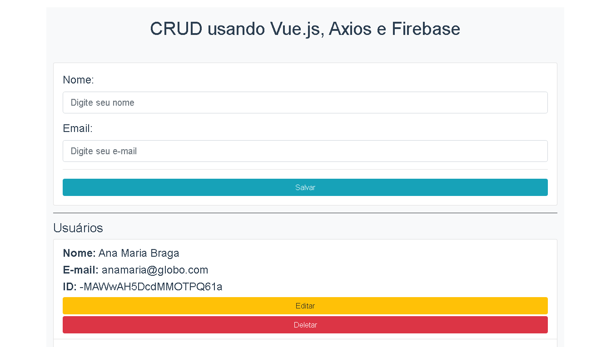

# CRUD usando Vue.js, Axios e Firebase

<h1 align="center">
  
</h1>

## Setup do Projeto

Para rodar o projeto em sua máquina, siga os seguintes passos com um terminal aberto no diretório do projeto

```
# Instale as dependências
$ yarn install

# Rode o projeto
$ yarn serve
```
