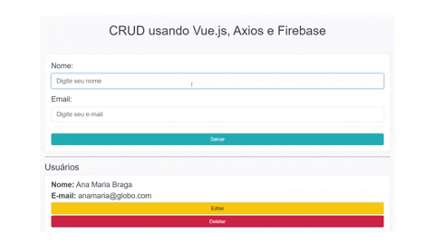

# CRUD usando Vue.js, Axios e Firebase

&nbsp;&nbsp;&nbsp;&nbsp;&nbsp;&nbsp;&nbsp;&nbsp;&nbsp;
&nbsp;&nbsp;&nbsp;&nbsp;&nbsp;&nbsp;&nbsp;&nbsp;&nbsp;
&nbsp;&nbsp;&nbsp;&nbsp;&nbsp;&nbsp;&nbsp;&nbsp;&nbsp;
&nbsp;&nbsp;&nbsp;&nbsp;&nbsp;&nbsp;&nbsp;&nbsp;&nbsp;
&nbsp;&nbsp;&nbsp;&nbsp;&nbsp;

<hr>

Esse foi um projeto feito no módulo de Axios do curso de Vue.js da Cod3r, nesse módulo, nosso objetivo foi ver como podemos usar a lib axios dentro de aplicações Vue.js

## Setup do Projeto

Para rodar o projeto em sua máquina, siga os seguintes passos com um terminal aberto no diretório do projeto

```
# Instale as dependências
$ yarn install

# Rode o projeto
$ yarn serve
```
